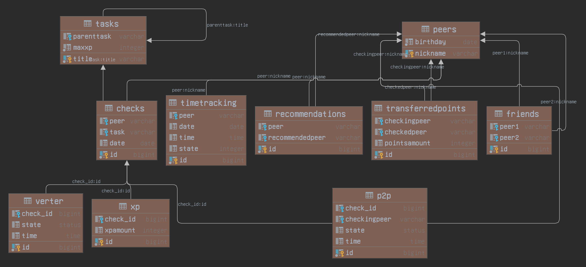
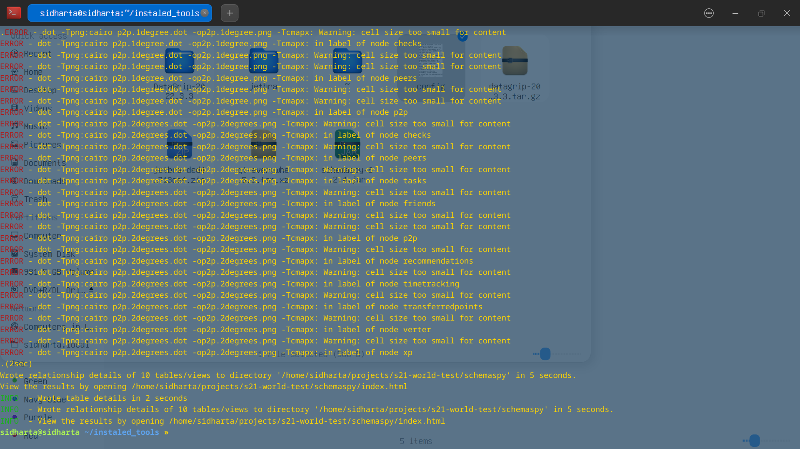

# Тестовый репозиторий
## Тестирую базу данных, а точнее инструменты для отрисовки схемы.

### Что выявленно на данный момент:
* Инструмент schemaspy, работает, делает отчет в формате HTML, результат работы этой утилиты можно найти в папке "schemaspy" файл "index.html"
* Пока по прежнему не понимаю, можно ли это как то делать автоматически при каждом пуше измененний базы данных в репозиторий.
  Наверняка это возможно какими нибудь инструментами CI/CD.
* DataGrip имеет собственный инструмент для экспорта диаграммы вашей базы данных, экспорт в различные форматы такие как svg, PNG, спецефические форматы файлов .uml, 
  .md, .gpraphml, а так же зашарить схему в различные онлайн сервисы для отрисовки, типа уже знакомых нам draw.io, diagrams.net и т.д.

Ниже пример экспорта в png

### Note

К стати во время работы утилиты schemaspy у меня вылазили ошибки по типу -целевой контент слишком мал для отображения, если что ниже скрин с ошибками, но тем не менее свою работу утилита исполняет и как упоминалось выше лежит в одноименной папке schemaspy.

